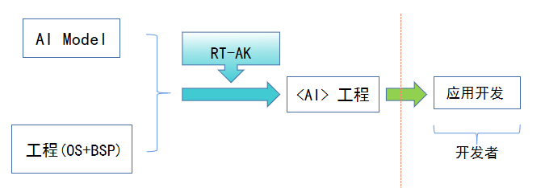
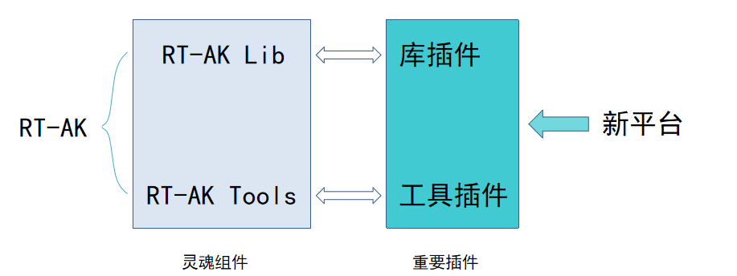

# 目录

- [1. 简介](#1.-简介)
  - [1.1 RT-AK 工作简介](#1.1-RT-AK-工作简介)
  - [1.2 RT-AK 两大组件和插件说明](#1.2-RT-AK-两大组件和插件说明)
- [2. 目录结构](#2.-目录结构)
- [3. 演示示例](#3.-演示示例)
  - [step 1 准备](#step-1-准备)
  - [step 2 使用 RT-AK](#step-2-使用-RT-AK)
  - [step 3 编译](#step-3-编译)
  - [step 4 下载固件](#step-4-下载固件)
  - [其他 - 项目实战](#其他-使用第三方目标平台项目实战)
- [4. 未来将完善](#4.-未来将完善)

**Update 2021/05/26**

- add English  [RT-AK Quick Start](documents/RT-AK%20Quick%20Start%20EN.md)

# 1. 简介

`RT-AK` 是 `RT-Thread` 团队对 `RT-Thread` 系统所开发的 `AI` 套件，

能够使用一行命令实现**将 `AI` 模型一键部署到 `RT-Thread` 系统中**，

真正做到让开发者远离 **嵌入式AI** 开发难、部署难、应用难得问题，能够使用更简单方便的 `API` 开发自己的应用程序。

## 1.1 RT-AK 工作简介

`RT-AK` 的工作基于两部分：

- 其中是包含 `RT-Thread` 系统与目标平台 `BSP` 的基础工程
- **神经网络模型**

当代码顺利执行完成之后后，会自动将 `AI` 模型集成进 `BSP` 。

（Ps: 此时的 `BSP` 已经包含模型实现的所有代码，但是还不存在运行模型推理的应用代码，该部分需要开发者们自行撰写，具体可参考 [RT-AK MNIST 应用参考示例](https://github.com/RT-Thread/RT-AK/blob/main/RT-AK/documents/RT-AK%E5%BF%AB%E9%80%9F%E4%B8%8A%E6%89%8B.md#6-rt-ak-mnist-%E5%BA%94%E7%94%A8%E5%8F%82%E8%80%83%E7%A4%BA%E4%BE%8B)）

开发者们可以根据 `RT-AK Lib`  提供的 `API` 进行项目开发。 | [API 链接](./rt_ai_lib/readme.md)



<center><font size=2 color="gray">RT-AK 工作方式</font></center>

## 1.2 RT-AK 两大组件和插件说明

**`RT-AK` 之两大组件：**

- RT-AK Tools
- RT-AK Lib

|              | RT-AK Tools                                                  | RT-AK Lib                                                    |
| ------------ | ------------------------------------------------------------ | ------------------------------------------------------------ |
| 功能         | 在**上位机**实现 `AI` 模型转换，并且部署到 `BSP`，获得集成 `AI` 的 `BSP`<br>(注意：不会生成新的BSP) | 在**嵌入式端**完成 `AI` 模型推理的静态库，包括模型注册、初始化、获取输出等<br>应用代码所用的 API 接口说明 |
| 对应文件路径 | `./rt_ai_tools`                                              | `./rt_ai_lib`                                                |
| 详细说明     | [rt_ai_tools/README.md](./rt_ai_tools/README.md)             | [rt_ai_lib/readme.md](./rt_ai_lib/readme.md)                 |
| 编程语言     | `Python`                                                     | `c`                                                          |


<center><font size=2 color="gray">RT-AK Tools 和 Lib 的工作范围</font></center>

> - Date:2021/06/21
>
> - Update:
>
>   RT-AK **暂未提供**的 **AI 工具和推理库**，现在所使用的是芯片厂商所提供的AI 工具和推理库，以便利用原厂资源，充分发挥硬件性能。
>
>   如果所使用的芯片型号想要使用 RT-AK 成功部署 AI 模型，**且无 AI 工具和推理库**，请提 PR 或者与我们联系。business@rt-thread.com

---

**`RT-AK` 之插件说明：**



<center><font size=2 color="gray">RT-AK 拓展第三方目标平台</font></center>

`RT-AK` 与目标平台的适配是通过**插件**实现的。

插件包含两部分：库插件和工具插件。

其中库插件：

- 实现目标平台与 `RT-AK Lib` 的后端适配
- 以及提供 `AI` 模型在嵌入式端推理的 `API` 接口；

工具插件：

- 实现 `AI` 模型格式转换
- 生成对应的 `AI` 模型信息文件和与目标平台信息相关的模型声明文件

插件代码位于：`./rt_ai_tools/platforms` 路径下，其中 `plugin_example` 为示例插件。

当 `RT-AK` 需要适配一个新的目标平台时，无需更改 `RT-AK` 主体代码，只需要按照格式补充工具插件和库插件即可。

## 1.3 RT-AK 架构


<center><font size=2 color="gray">RT-AK 架构图</font></center>

上图左半部分是 `RT-AK Tools` 的简单的架构图；

上图右半部分是 `RT-AK Libs` 的简单的架构图。

# 2. 目录结构

```shell
D:\Project\edge-ai\RT-AK>tree /a
卷 软件 的文件夹 PATH 列表
卷序列号为 E67E-D1CA
D:.
+---documents
+---examples
+---rt_ai_lib
+---rt_ai_tools
\---test
    +---features
    +---image
    \---step_defs
```

| 文件夹        | 说明                                                       |
| ------------- | ---------------------------------------------------------- |
| `documents`   | `RT-AK` 相关文档，比如常见问题、快速上手等                 |
| `rt_ai_lib`   | `RT-AK Lib`，适配第三方目标平台插件与 `RT-Thread` 系统相关 |
| `rt_ai_tools` | `RT-AK Tools`，使用第三方目标平台插件进行模型转换等工作    |
| `test`        | `RT-AK` 测试用例，使用的是 `Pytest-bdd` 测试框架           |

# 3. 演示示例

- [x] **仅支持 `Windows 10`**
- [x] **Python >= 3.7**
- [x] **该演示示例不使用任何第三方目标平台插件**

## step 1 准备

需要准备以下三份材料：

| Index |                           Prepare                            |
| :---: | :----------------------------------------------------------: |
|   1   |            硬件以及 `BSP`，示例使用的是 `ART-PI`             |
|   2   | 神经网络模型，示例使用的是 `./rt_ai_tools/Model/keras_mnist.h5` |
|   3   |                     将项目代码克隆到本地                     |

硬件选择 `ART-PI`，准备一个项目工程

- 可通过 `RT-Thread Studio` 来生成
- 或者直接下载我们所提供的 `BSP` 👉 [传送门](http://117.143.63.254:9012/www/RT-AK/sdk-bsp-artpi.zip)

> - [ ] **TO DO LIST**: 未来将会提供 `QEMU BSP`，无需依赖硬件

## step 2 使用 RT-AK

使用 `RT-AK` 之后，就可获得一个集成了 `AI` 的 `BSP`，就可以在上面愉快的开发啦！

```shell
$ cd rt_ai_tools

# 使用默认模型和默认目标平台，默认目标平台为 `./rt_ai_tools/platforms/example`
$ python aitools.py --project=<your_bsp_path>

# 指定模型路径和指定目标平台
$ python aitools.py --project=<your_bsp_path> --model=<model_path> --platform=<platform>
```


<center><font size=2 color="gray">使用默认模型和默认目标平台工作</font></center>


<center><font size=2 color="gray">指定模型参数和目标平台插件</font></center>

## step 3 编译

进入到你的项目工程路径，然后编译。

示例中选择的是 `scons` 编译 (在这里默认你已经配置好了 `RT-Thread` 的 [env](https://www.rt-thread.org/document/site/#) 环境，并且会使用 `scons -j 6` 编译)


<center><font size=2 color="gray">scons 编译成功界面</font></center>

## step 4 下载固件

- 硬件：`ART-PI`
- 烧录工具：
  - `STM32Programmer`
  - `RT-Thread Studio`
  - `Keil`
  - ...

> 在后续版本中，演示示例将会基于 QEMU，该步骤将会进一步做简化
>
> 对第四步操作有困惑的同学请看👇项目实战部分，有完完整整的步骤和说明

## 其他-使用第三方目标平台项目实战

| 配置           | 说明                                           |
| -------------- | ---------------------------------------------- |
| 第三方目标平台 | `STM32`                                        |
| 项目工程       | `ART-PI BSP`                                   |
| 神经网络模型   | `rt_ai_tools/Model/keras_mnist.h5`             |
| 项目实战手册   | [RT-AK快速上手.md](documents/RT-AK快速上手.md) |

# 4. 未来将完善

- [x] Linux 支持
- [ ] Windows 7 支持
- [ ] Qemu 示例 DEMO
- [ ] I/O 对接 device 框架进行标准化
- [ ] 自研 AI 模型转换工具和推理库
- [ ] 量化支持
- [ ] 经典算法的效果对比与选择
- [ ] 算子不支持
- [ ] 芯片算力和内存不足的问题

